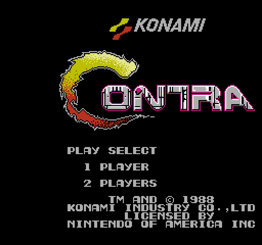

#  Poncho

*A handcrafted Nintendo Entertainment System emulator, written in TypeScript, played in your browser.*

[](https://github.com/DaJungle79/poncho/actions/workflows/ci.yml)
[](https://github.com/DaJungle79/poncho/actions/workflows/deploy.yml)
[](LICENSE)

[**Try it →**](https://dajungle79.github.io/poncho/)  (bring your own `.nes` file)



---

## Hello there

Sometimes you just want to play a game from when you were a kid. Maybe Castlevania. Maybe Contra. Maybe Metroid. The cartridge is in a box somewhere and the console hasn't been plugged in for a decade, and *you don't feel like setting it all up.*

That's what Poncho is for.

It's also for the kind of person who, halfway through their tenth nostalgic playthrough, started wondering how the NES *actually worked* — and decided the best way to find out was to build one.

So here we are. About 8,300 lines of TypeScript, no game-specific hacks, every chip built from the documented hardware. Open a webpage. Drop a `.nes` file in. Press Start.

## Quickstart

```bash
git clone https://github.com/DaJungle79/poncho.git
cd poncho
npm install
npm run setup          # optional — copies ONNX runtime sidecars (only needed if you bring your own ONNX model)
npm run dev
```

Open <http://localhost:5173>. The **Consoles** panel opens first. Use the **ROMs** button on a console card to show or hide that console's ROM bay, then either:

- **Add a ROM** — opens a local add view with a drop zone; uploaded ROMs are saved to browser storage (IndexedDB), surviving reloads
- **Drop a file in `roms/`** — appears under "Server" while the dev server is running

(Poncho doesn't ship any games. Bring your own.)

## Features

### Emulation

- **Cycle-accurate 6502 / 2A03 CPU** — all 151 official + 25 illegal opcodes, per-cycle bus accesses with phantom reads on indexed addressing and dummy writes on read-modify-write. Passes nestest cleanly.
- **Full 2C02 PPU** — scanline-stepped background + sprite shifters, sprite-0 hit, sprite overflow, runtime mirroring, $2002/$2007/OAM-DMA semantics
- **All five APU channels** — pulse × 2, triangle, noise, DMC — feeding the canonical NES non-linear mixer through 90 Hz / 440 Hz / 14 kHz analog filters
- **Six cartridge mappers** covering ~85% of the commercial library
- **Programmable mirroring**, MMC3 IRQ counter with A12 filter

### User interface

- **Retro NES aesthetic** 
- **Light + dark themes** — switchable in Settings, persisted across reloads
- **Rebindable keyboard controls** — click any binding, press the new key
- **Adjustable scale** (1×, 2×, 4× nearest-neighbour) and audio volume

### ROM management

- **Browser storage** — uploaded ROMs persist across browser sessions; Classic NES stores `.nes`, while Poncho-NES stores `.poncho`
- **Server folder** — files placed in `roms/` are served by the Vite dev middleware (development only)

### AI upscale (Poncho-NES, v0.4) Alpha!

- **Pluggable upscale model registry** — `src/convert/upscale-registry.ts` is the single source of truth. The shipped UI registers only the deterministic 4× nearest-neighbour fallback; ESRGAN, AnimeSharp, and SPAN-x4 were prototyped but didn't pass the quality bar on pixel-art primer (see [`docs/v0.4.0-plan.md`](docs/v0.4.0-plan.md) Phase 5a notes).
- **Convert .nes → .poncho** — open **Consoles**, show the Poncho-NES **ROMs** bay, click **Add ROM**, and drop or pick a `.nes` file. The add view explains that the ROM will be converted, shows **Upscale**, and then saves the resulting `.poncho` into browser storage. CHR-ROM games go through the bake-now pipeline (every unique tile is processed and embedded in the `.poncho` AI cache section); CHR-RAM games are wrapped verbatim and the runtime worker fills the cache lazily during play.
- **Custom-model attach** — the Poncho-NES add flow accepts a user-supplied `.onnx` file when **Upscale** is enabled for a `.nes` conversion. The wiring assumes the standard pixel-art SR contract (8×8 → 32×32, NCHW, RGB, [0..1] fp32, pin names `input`/`output`). Mismatched models surface a clear error from `OnnxUpscaleClient`'s preflight instead of silently NN-falling-back every tile.
- **Self-upgrading `.poncho` file** — runtime upscales are written back into the cartridge's AI cache section (every 60 s + on cart eject), so each session bakes a few more tiles permanently. Subsequent plays start from that cache; eventually AI work drops to zero.
- **Node-side ESRGAN/SPAN bake CLI** — `npm run poncho:convert -- <input.nes> --model Real-ESRGAN-x4plus` runs `OnnxUpscaleClient` through `onnxruntime-node` (CoreML on macOS, CPU fallback). Bypasses the browser entirely. See `npx tsx scripts/poncho-convert.ts --help` for the full flag list.
- **Adding a new model in code**: implement `UpscaleClient` (or reuse `OnnxUpscaleClient` with a different config), allocate a numeric `cacheModelId` in `ai-cache.ts`, register the `UpscaleModel` definition in `upscale-registry.ts`.


### Architecture

- **Shell-decoupled** — emulator core, renderer, audio mixer, and DOM-based UI are all platform-agnostic; the web shell lives in `src/platform/web/` behind a `Platform` interface so an Electron / Tauri build is a small additional adapter
- **Pluggable rendering pipeline** — separate filter and scaler stages so CRT, NTSC, scanline effects can drop in without touching the renderer
- **Pluggable RomInfo sources** — wire ScreenScraper, TheGamesDB, or your own backend behind the existing cache
- **Per-cycle bus access model** — exposes hooks for mapper-driven IRQs (MMC3) and per-dot PPU events without further refactor

### Browser support

Poncho needs a modern browser — specifically AudioWorklet (for sound) and IndexedDB (for the ROM library).

| Browser | Minimum version | Notes |
|---|---|---|
| Chrome / Edge | 66+ | Full support |
| Firefox       | 76+ | Full support |
| Safari        | 14.1+ | Full support; older iOS Safari may throttle audio in background tabs |

Audio is muted until you interact with the page — that's a browser autoplay policy, not a Poncho thing.

### Default controls

```
   ↑ ↓ ← →     D-pad
       Z       B
       X       A
       C       Select
       V       Start
```

Rebind any binding under **Settings → Controls**.

## Virtual consoles

Poncho hosts more than one virtual console under one runtime. Each is a *composition* of chips from `src/core/` (CPU, PPU, APU, buses, mappers) wired together. Pick the active console from the sidebar (top icon, hotkey `0`), then use the console card's **ROMs** button to load cartridges for that console.

| | NES (working) | Poncho-NES (beta) |
|---|---|---|
| **CPU** | Ricoh 2A03 @ 1.79 MHz | Ricoh 2A03 @ 1.79 MHz |
| **PPU** | 2C02 | 2C02-Ultra |
| **Resolution** | 256 × 240 | 1024 × 960 |
| **Colours on screen** | 32 | 2048 |
| **Sprite size** | 8 × 8 | 32 × 32 |
| **Sprites per scanline** | 8 | 32 |
| **APU** | 5-channel 2A03 | identical |
| **Cart formats** | iNES (`NES\x1A`) | PonchoROM (`PNCH`) + iNES (NES-compat mode, `.nes` rendered at 4× scale) |

Full architecture and the PonchoROM format spec live in [`docs/consoles.md`](docs/consoles.md) and [`docs/poncho-rom.md`](docs/poncho-rom.md). The hardware specs above are a snapshot of [`src/console/specs.ts`](src/console/specs.ts), which is the source of truth.

## Compatible games (by mapper)

Six cartridge mappers, covering roughly 85% of the commercial library:

| Mapper | Games it plays |
|---|---|
| **NROM** (0)   | Super Mario Bros., Donkey Kong, Galaga, Ice Climber |
| **MMC1** (1)   | The Legend of Zelda, Metroid, Final Fantasy, Dragon Warrior |
| **UxROM** (2)  | Castlevania, Mega Man, Contra, Duck Tales |
| **CNROM** (3)  | Adventure Island, Solomon's Key, Ghosts'n Goblins |
| **MMC3** (4)   | Super Mario Bros. 3, Mega Man 3-6, Kirby's Adventure, Crystalis |
| **AxROM** (7)  | Battletoads, Marble Madness, RC Pro-Am |

The remaining ~15% spreads across many low-coverage mappers; adding new ones is a small, additive change documented in [`DEFERRED.md`](DEFERRED.md).

## Tests

```bash
npm test         # all tests
npm run test:watch
npm run typecheck
```

**202 tests across 28 files.** About 110 are pure unit tests — CPU instructions, addressing modes, channel envelopes, mapper bank logic, scaler arithmetic, RomInfo filename parsing. The rest run real ROMs through a blargg-protocol harness:

| Suite                       | Pass |  Total |
|---|---:|---:|
| nestest (CPU full)          |  1  |  1  |
| blargg `apu_mixer`          |  4  |  4  |
| blargg `oam_*`              |  2  |  3  |
| blargg `apu_test`           |  3  |  8  |
| blargg `ppu_vbl_nmi`        |  1  | 10  |
| blargg `sprite_overflow`    |  2  |  5  |
| blargg `sprite_hit_tests`   |  1  | 11  |

The synthetic-timing failures share a single architectural gap (sub-cycle bus alignment) — see [`DEFERRED.md`](DEFERRED.md) for the unified explanation. Real games of every supported mapper render and play.

ROMs and test ROMs are gitignored. Test ROMs go in `tests/roms/`; integration tests skip cleanly when files are absent, so CI runs green without them.

## Look under the hood

A high-level tour with diagrams lives in [`docs/architecture.md`](docs/architecture.md). The deeper "*why* the per-cycle bus model is shaped like that" notes are in [`CLAUDE.md`](CLAUDE.md). Release notes: [`CHANGELOG.md`](CHANGELOG.md).

The important modules:

| Module | What's there |
|---|---|
| `src/core/cpu/`      | Per-cycle 2A03 (6502 minus decimal mode), all 151 official + 25 illegal opcodes |
| `src/core/ppu/`      | 2C02 scanline pipeline, background + sprite shifters, sprite-0 hit |
| `src/core/apu/`      | Frame counter, 5 channels, non-linear mixer, RC filters |
| `src/core/mappers/`  | NROM, MMC1, UxROM, CNROM, MMC3, AxROM |
| `src/renderer/`      | Filter and Scaler pipelines, kept separate so CRT/NTSC effects can plug in later |
| `src/platform/types.ts` | Platform interface — implement this to add a new shell |
| `src/platform/web/`  | Web-shell platform: AudioWorklet, IndexedDB, dev-server `/roms/`, `<input type=file>` |
| `src/shells/web/`    | Web shell: bootstrap, App orchestrator, and the DOM panel tree under `ui/` |

If you'd rather skip ahead and read about *what's still missing*, that's in [`DEFERRED.md`](DEFERRED.md) — every known gap with *what*, *why deferred*, and *how a fix would be verified*.

## Adding a new shell

A shell consists of a `Platform` factory under `src/platform/<name>/` (audio, storage, ROM library, file picker) and a shell directory under `src/shells/<name>/` with its own `main.ts`, `app.ts`, and `ui/` tree. Sketch:

```ts
// src/platform/electron/index.ts
export function createElectronPlatform(): Platform {
  return {
    audio:           new WebAudioSink(),         // works in Electron renderer
    configStorage:   new FsStorage('config.json'),
    romInfoStorage:  new FsStorage('rominfo.json'),
    romLibrary:      new ElectronRomLibrary(),   // ipcRenderer + fs
    serverRoms:      null,                       // hides the Server section
    filePicker:      new ElectronFilePicker(),   // dialog.showOpenDialog
  };
}

// src/shells/electron/main.ts
import { App } from './app';                     // shell-owned orchestrator
const app = new App(createElectronPlatform(), /* shell-owned DOM refs */);
app.run();
```

Everything under `src/core/`, `src/renderer/`, `src/audio/`, `src/config/`, `src/rom/`, `src/domain/` is reused verbatim. UI is **not** shared across shells — each shell evolves its panels independently. If two shells eventually converge, lift the common pieces into a shared module then.

## Roadmap

Where Poncho is heading lives in [`ROADMAP.md`](ROADMAP.md), grouped by theme (near-term / mid-term / long-term). Headline items: save states + battery-backed SRAM, sub-cycle PPU/APU timing rework, more mappers (MMC2 / MMC5 / VRC6), CRT post-processing, debug overlay, gamepad support, an Electron / Tauri shell.

Bugs and known gaps in *shipped* code live separately in [`DEFERRED.md`](DEFERRED.md) — every entry has *what*, *why deferred*, and *how to verify a fix*.

Pull requests welcome.

## Thank you

This wouldn't exist without:

- **blargg**, for the canonical NES test ROM suites that turn an opaque hardware spec into something debuggable
- **the nesdev community**, for documentation that's somehow free *and* meticulous
- **christopherpow**, for hosting clean GitHub mirrors of the test ROMs
- **Lucide** and the **game-icons.net** authors for the icons
- **everyone who's reverse-engineered the 2A03 and 2C02** since the early 2000s

## License

GPL-3.0-or-later. See [`LICENSE`](LICENSE) for the full text. In short: do what you like with this code; if you ship modifications, ship the source too.

---

*— Ivailo Ivanov*
