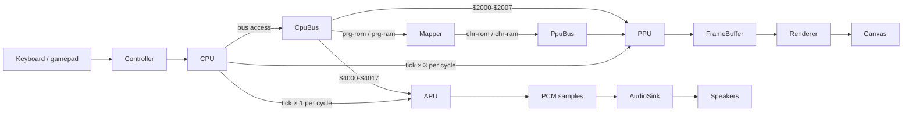
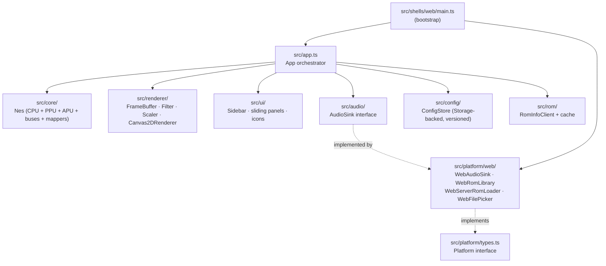

# Architecture

Quick orientation. For the *why-it-works-this-way* details (per-cycle synchronization, addressing-mode twins, frame-end latching, etc.) read [`CLAUDE.md`](../CLAUDE.md).

---

## Per-frame data flow

The CPU is the master clock. Every CPU bus access ticks the rest of the system *before* the access — APU 1×, PPU 3× per CPU cycle. `Nes.runFrame()` returns when the PPU enters vblank.

Frame end is latched inside the CPU's per-cycle tick callback the moment the PPU returns `true` from `tick()` (vblank-start dot). `runFrame()` polls that flag.

## Module layering

The codebase is layered so that everything below `src/platform/` is shell-agnostic. A new shell (Electron, Tauri, native) only needs to implement the `Platform` interface.

Things to know:

- `src/core/` has no DOM, no Node, no fetch. The same `Nes` class drives the browser main loop *and* the headless integration tests.
- `src/renderer/` is a pure pipeline (`preFilters → scaler → postFilters`). Each stage shares the `RenderStage` interface, so adding CRT / NTSC effects is "drop in a new filter, register it, list it in config".
- `src/platform/types.ts` is the seam: `audio`, `configStorage`, `romInfoStorage`, `romLibrary`, `serverRoms`, `filePicker`. The web shell at `src/platform/web/` wires browser APIs to those slots.
- `src/app.ts` takes a `Platform` plus a small `AppDom` of element refs. It owns the run loop and the panels but knows nothing about which shell it's running in.

## Adding a shell

1. Implement `Platform` from `src/platform/types.ts` (e.g. `src/platform/electron/index.ts`).
2. Add a bootstrap entry under `src/shells/<name>/main.ts` that calls `new App(...).run()`.
3. Re-use `src/core/`, `src/renderer/`, `src/audio/`, `src/ui/`, `src/app.ts`, and the panel components verbatim.

The DOM-heavy UI (sidebar + sliding panels) reuses cleanly inside any Chromium-based renderer.

## ROM loading paths

Two ROM directories serve different purposes; both are gitignored.

- `roms/` — **games**. Surfaced in dev by a Vite middleware in `vite.config.ts` that exposes a JSON listing at `/roms/` and the file bytes at `/roms/<name>`.
- `tests/roms/` — **test ROMs** (nestest, blargg). Resolved by integration tests via `tests/rom-paths.ts`. Tests `skipIf(!existsSync(...))` so CI runs green without them.

Three browser-side load paths, all returning `LoadedRom { name, source, data }`:

| Path | Backed by |
|---|---|
| Server folder | `WebServerRomLoader` → Vite `/roms/` middleware |
| File upload   | `WebFilePicker` (`<input type=file>`) → `WebRomLibrary` (IndexedDB) |
| Browser library | `WebRomLibrary` (IndexedDB) |

## See also

- [`CLAUDE.md`](../CLAUDE.md) — per-cycle sync model, addressing-mode twins, frame-end latching, conventions.
- [`DEFERRED.md`](../DEFERRED.md) — known gaps and how a fix would be verified.
- [`CHANGELOG.md`](../CHANGELOG.md) — release notes.
