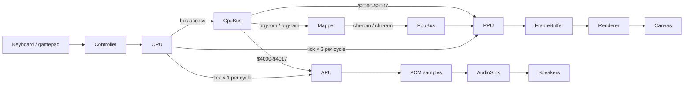
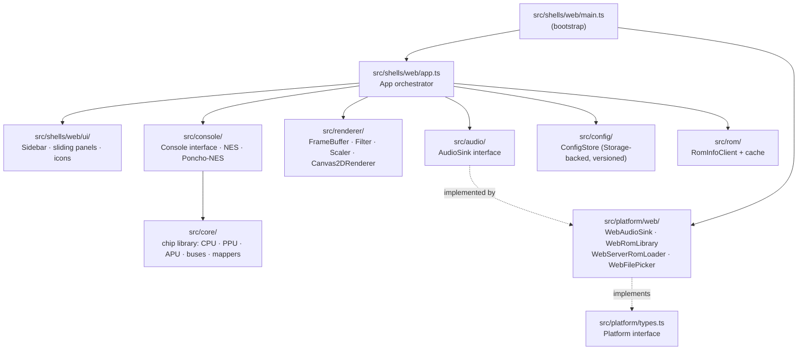

# Architecture

Quick orientation. For the *why-it-works-this-way* details (per-cycle synchronization, addressing-mode twins, frame-end latching, etc.) read [`CLAUDE.md`](../CLAUDE.md). For the catalogue of supported virtual consoles and their hardware capabilities, read [`consoles.md`](consoles.md).

---

## Per-frame data flow

The CPU is the master clock. Every CPU bus access ticks the rest of the system *before* the access — APU 1×, PPU 3× per CPU cycle. `Nes.runFrame()` returns when the PPU enters vblank.



Frame end is latched inside the CPU's per-cycle tick callback the moment the PPU returns `true` from `tick()` (vblank-start dot). `runFrame()` polls that flag.

## Module layering

The codebase is layered so that everything outside `src/platform/` and `src/shells/` is shell-agnostic. A new shell brings its own `Platform` factory *and* its own App + UI. The emulator runtime itself is split between **chips** (`src/core/`) and **compositions** that wire chips into a virtual console (`src/console/`).



Things to know:

- `src/core/` is a pure chip library: CPU, PPU, APU, buses, cartridge, mappers. No DOM, no Node, no fetch. Each chip is self-contained — the 6502 doesn't know it's "in an NES".
- `src/console/` holds compositions: each file picks chips from `src/core/` and wires them. `nes.ts` and `poncho-nes.ts` both implement the `Console` interface so the shell can drive either. The full catalogue with hardware specs is in [`consoles.md`](consoles.md).
- `src/renderer/` is a pure pipeline (`preFilters → scaler → postFilters`). Each stage shares the `RenderStage` interface, so adding CRT / NTSC effects is "drop in a new filter, register it, list it in config".
- `src/platform/types.ts` is the platform-API seam: `audio`, `configStorage`, `romInfoStorage`, `romLibrary`, `serverRoms`, `filePicker`. Implemented per-shell under `src/platform/<name>/`.
- `src/shells/<name>/` is the *shell* seam: each shell owns its own bootstrap, App orchestrator, and UI tree. The web shell's App lives at `src/shells/web/app.ts`; its panels at `src/shells/web/ui/`. UI is intentionally **not** shared across shells — duplication is fine until two shells converge on a UI worth lifting out.

## Renderer pipeline

`src/renderer/` is a stateless pipeline composed of three stages: `preFilters → scaler → postFilters`. Each stage implements `RenderStage` (`outputSize` + `apply`). `Canvas2DRenderer.render()` walks input → preFilters → scaler → postFilters → canvas, hopping between two scratch `FrameBuffer`s.

```
FrameBuffer (256×240 NES  or  1024×960 Poncho-NES)
      │
      ▼ preFilters[]         (empty in v0.5 — CRT / NTSC reserved)
      │
      ▼ Scaler               picks one:
      │   nearest-1x / 2x / 4x   — fast pixel doubling
      │   xbrz-2x … xbrz-6x      — YCbCr pattern-match-and-blend (Phase 1)
      │   mmpx-2x                 — 3×3 copy scaler, source-palette-only (Phase 2)
      │
      ▼ postFilters[]        (empty in v0.5)
      │
      ▼ Canvas2D blit
```

**Scaler registry** (`src/renderer/scalers/index.ts`): maps string id → `() => Scaler` factory. To add a scaler: implement `Scaler` (which extends `RenderStage`), add an entry to the registry map and the `ScalerId` union type.

**Three distinct upscaling layers** — avoid confusing them:

| Layer | Location | When | What v0.5 ships |
|---|---|---|---|
| A — Renderer scaler | `src/renderer/scalers/` | Runtime, every frame, post-render | `XbrzScaler`, `MmpxScaler` |
| B — PpuUltra NN fallback | `renderScanlineUpscaled` | Runtime, per tile on resolver miss | Unchanged — cheap NN fallback |
| C — UpscaleClient bake | `src/convert/upscale-registry.ts` | Convert-time or background worker | `XbrzUpscaleClient` (`xbrz-4x-snap`) |

Classic NES only has layer A. Poncho-NES with a baked cart uses layer C at convert time and layer B at runtime on cache misses; layer A is only applied on top when the user explicitly picks xBRZ in Settings (useful for unbaked carts).

## Adding a shell

1. Implement `Platform` from `src/platform/types.ts` under `src/platform/<name>/` (factory: `create<Name>Platform()`).
2. Build `src/shells/<name>/main.ts` (bootstrap), `src/shells/<name>/app.ts` (orchestrator), and a `ui/` tree.
3. Reuse `src/core/`, `src/renderer/`, `src/audio/`, `src/config/`, `src/rom/`, `src/domain/` verbatim.

## ROM loading paths

Two ROM directories serve different purposes; both are gitignored.

- `roms/` — **games**. Surfaced in dev by a Vite middleware in `vite.config.ts` that exposes a JSON listing at `/roms/` and the file bytes at `/roms/<name>`.
- `tests/roms/` — **test ROMs** (nestest, blargg). Resolved by integration tests via `tests/rom-paths.ts`. Tests `skipIf(!existsSync(...))` so CI runs green without them.

Three browser-side load paths, all returning `LoadedRom { name, source, data }`:

| Path | Backed by |
|---|---|
| Server folder | `WebServerRomLoader` → Vite `/roms/` middleware |
| File upload   | `WebFilePicker` (`<input type=file>`) → `WebRomLibrary` (IndexedDB) |
| Browser library | `WebRomLibrary` (IndexedDB) |

## See also

- [`CLAUDE.md`](../CLAUDE.md) — per-cycle sync model, addressing-mode twins, frame-end latching, conventions.
- [`DEFERRED.md`](../DEFERRED.md) — known gaps and how a fix would be verified.
- [`CHANGELOG.md`](../CHANGELOG.md) — release notes.
